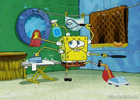
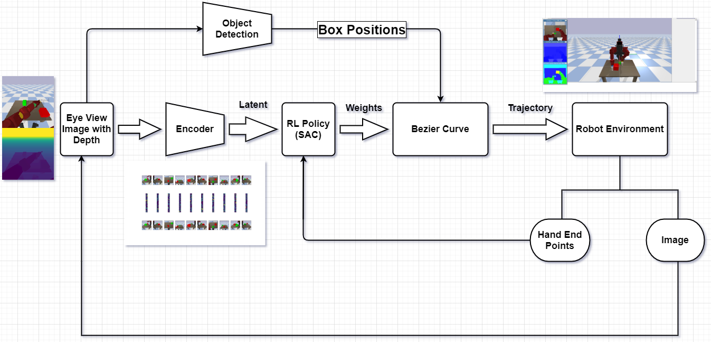

<h1 align=center> Baxter Environment </h1>
<h3 align=center> Simultaneous Multitasking Agent</h3>


### 1.0.1. Aim

To train an end to end agent which mimics human behaviour of doing **multiple tasks simultaneously** using a single image frame.


### 1.0.2. Inspiration

<p align=left>Humans have a very good efficiency of managing different things simultaneously using both hands. Hence, we want to explore how the <b>Reinforcement Learning</b> Algorithms are trying to achieve this task in comparison to humans because this a very difficult task for a robot to address using some classical techniques and achieve human level awareness of environment.</p>

<p align="center" align=right>
<!--   -->
</p>

## 1.1. Initial plannings
We have divided our work into several steps which we want to achieve one by one.

- [x] Creating experimental and environmental setup
- [ ] Finding **Joint Reward** Function
- [ ] Learn easy simultaneous tasks first
- [ ] Increase task complexity
- [ ] Increase interaction complexity



## 1.2. Initial Tools and stuffs
- PyBullet base environment
- Baxter - prebuilt agent 
- Computer Vision
- Deep Reinforcement Learning 

## 1.3. Work done
A custom gym environment is Created whose snapshots are shown below.

install the environment using `pip install -e baxter-env`

After that use few lines to import it in your workspace

``` python
import gym
import baxter_env

env = gym.make('baxter_env-v0')

env.top_view()
```

<p float=left>
 
 
 
</p>

## 1.4. References 
- [Pybullet URDFs](https://github.com/erwincoumans/pybullet_robots)
- Stable Baselines [Colab Tutorial](https://colab.research.google.com/github/araffin/rl-tutorial-jnrr19/blob/master/1_getting_started.ipynb) &nbsp; [Docs](https://stable-baselines.readthedocs.io/en/master/)
