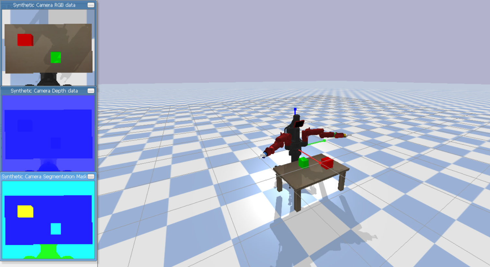
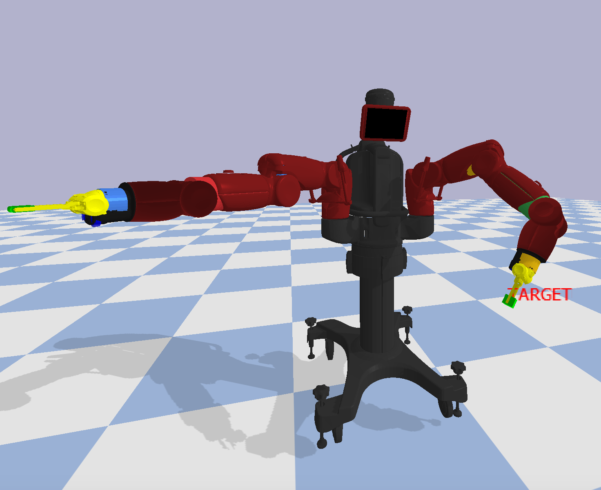
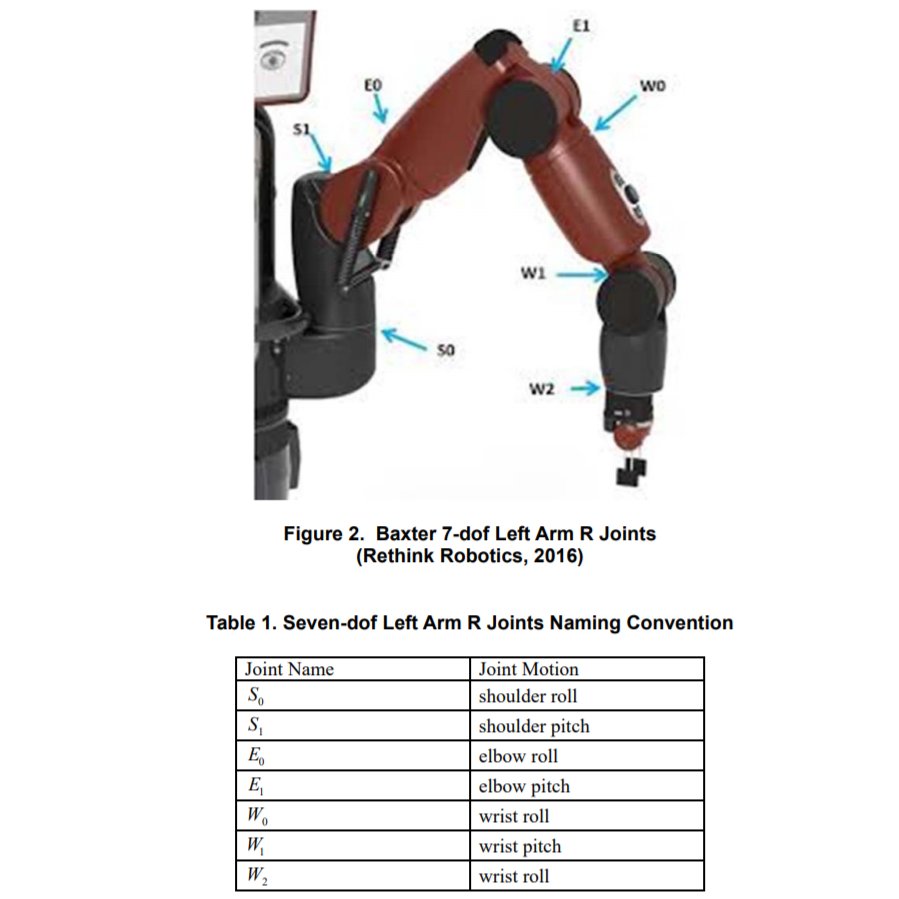

<h1 align=center> Baxter Environment </h1>
<h3><b>About the environment</b></h3>

This environment is made by our team from **Robotics-Club** of IIT BHU to tackle an open challenge in the field of robotics, which is *Simultaneous work*. Generally, Humans have a good efficiency in managing different things simultaneously using both hands. Hence, we want to explore how the <b>Reinforcement Learning</b> Algorithms are trying to achieve this task comparable to humans or even better. For this purpose **Baxter** humanoid robot is used as the Agent. It is a gym compatible environment made using simulator [PyBullet](https://pybullet.org/)<br>

<h3 align=center> (SMA) Simultaneous Multitasking Agent</h3>
<p align = 'center'>
<br>
</p>

Baxter was an industrial humanoid robot built by [Rethink Robotics](https://www.rethinkrobotics.com/). We used it in our environment to get a good idea of how the humanoid agent will behave when left in the same scenario as that of a human.For more info on baxter visit [this](https://www.ohio.edu/mechanical-faculty/williams/html/pdf/BaxterKinematics.pdf)
<br>
<p align = 'center'>


<h4 align = 'center'><b>Baxter</b></h4>
</p>

## Initial plannings
We have divided our work into several steps which we want to achieve one by one.

- [x] Creating experimental and environmental setup
- [ ] Finding **Joint Reward** Function
- [ ] Learn easy simultaneous tasks first
- [ ] Increase task complexity
- [ ] Increase interaction complexity

We made the required environment with aiming some basic works like simultaneous lifting, touching etc. Now we are working on our MDP formulation along with joint reward function.

##  **Installation Guidelines**
Anyone who want to conribute to this repo or want to modify it, will fork the repo and can create pull requests. One can also take this environment as a ready made setup for aiming the same challenges.
### Dependencies
- Python3
- PyBullet
- gym
- OpenCV
- numpy
- Matplotlib

After cloning the repo run following commands to quickly done with the required setup

- Install the environment using `pip install -e baxter-env`. It will automatically install the required additional dependencies

- In case there are problems with the PyBullet installation, you can refer to this [guide](https://github.com/Robotics-Club-IIT-BHU/Robo-Summer-Camp-20/blob/master/Part1/Subpart%201/README.md).

- After that use few lines to import it in your workspace.

``` python
import gym
import baxter_env

env = gym.make('baxter_env-v0')
```

<h2>Functions in our environment</h2>

After importing the environment, there are different functions available in the environment which can be used for various purposes, some of the important ones is listed below, for more details on the functions and arguments, you can see [here]()

- `env.getImage()`<br>
    This will return an RGB image of the environment along with the depth map from baxter's eye view.
- `env.step()`<br>
    This will take list of actions and perform that action along with providing required information of states..
- `env.moveVC()`<br>
    This will move the joints to a specified position by taking the index of that joint.
<<<<<<< HEAD
- `env.render()`<br>
    Function to render the eye view image of the environment.
- `env.reset()`<br> 
    This will reset the whole environment and gives the information regarding the state.

There are other functions also which we have made four our purpose like 
- `env.BeizerCurve()`<br> 
    This is an implementation of a family of curves which gives a trajectory passing through some points on the basis of some weights.
- `env.getReward()`<br>
-   This will return the reward for trying simultaneous touching     (naive implementation, working on making it better).
  
<h2 align = 'center'>Snapshots</h2>
<p align='center'>
Few images and gifs of our environment and robot in action using some classical techniques.<br>
 
</p>

## References 
- [Pybullet URDFs](https://github.com/erwincoumans/pybullet_robots)

## **Makers and Maintainers**

<table>
   <td align="center">
      <a href="https://github.com/monako2001">
         
         <br />
         <sub>
            <b>Mainak Samanta</b>
         </sub>
      </a>
      <br />
   </td>
   <td align="center">
      <a href="https://github.com/Akshatsood2249">
         
         <br />
         <sub>
            <b>Akshat Sood</b>
         </sub>
      </a>
      <br />
   </td>
   <td align="center">
      <a href="https://github.com/Amshra267">
         
         <br />
         <sub>
            <b>Aman Mishra</b>
         </sub>
      </a>
      <br />
   </td>
   <td align="center">
      <a href="https://github.com/arch-raven">
         
         <br />
         <sub>
            <b>Aditya Kumar</b>
         </sub>
      </a>
      <br />
   </td>
</table>

## **Our Mentors**

<table>
   <td align="center">
      <a href="https://github.com/lok-i">
         
         <br />
         <sub>
            <b>Lokesh Krishna</b>
         </sub>
      </a>
      <br />
   </td>
   <td align="center">
      <a href="https://github.com/NiranthS">
         
         <br />
         <sub>
            <b>Niranth Sai</b>
         </sub>
      </a>
      <br />
   </td>
</table>
